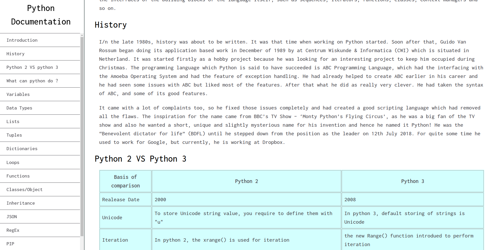
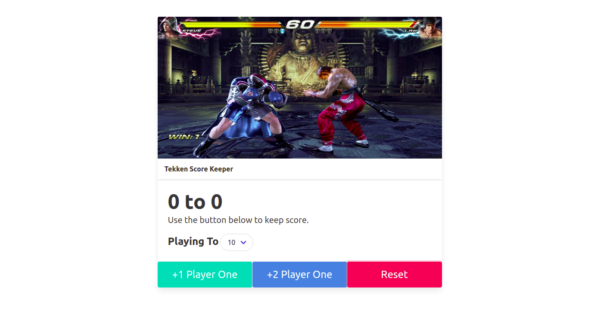
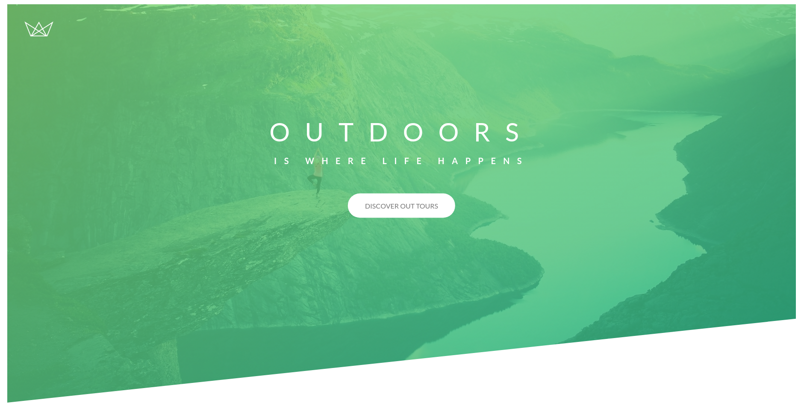

# Personal-projects
## This reopsitory includes small personal projects made for fun and to learn new skills

**What will the projects be about ?**
>Well, Mostly the projects will be realted to HTML, CSS, JS and python for the initial projects and after that I will try to include some more projects related to other topics like react, redux, advance CSS animation etc.  

## PROJECT 1
### Technical Documentation Page 
This project idea is from freeCodeCamp projects. I will be  writing a technical documentation on python, which will cover the history and basics of python. 

Code for [Techinal Documentation Page](https://github.com/dhruvsharma1999/personal-projects/tree/master/technicalDocumentation) is present here.

## PROJECT 2
### Javascript Score Keeper
A simple score keeper implemented using javascript and bulma, a css library.

Code for [Score Keeper.](https://github.com/dhruvsharma1999/personal-projects/tree/master/scoreChecker)

## PROJECT 3
### Yelp Camp
This projects basic structure is from udemy's course on full stack development by Colt Steele. I will try to implement custom features and animations.

Code for [Yelp Camp.](https://github.com/dhruvsharma1999/personal-projects/tree/master/yelpcamp)
## PROJECT 4
### Natours Blog 
This projects basic structure is from udemy's course on advance CSS and Saas. I will try to implement custom features and animation.

Code for [Natours Project.](https://github.com/dhruvsharma1999/personal-projects/tree/master/natoursProject)

## PROJECT 5
### Background Color

Code for [Background Color.](https://github.com/dhruvsharma1999/personal-projects/tree/master/change-background)

## PROJECT 6
### Simple Counter 

Code for [Simple Counter.](https://github.com/dhruvsharma1999/personal-projects/tree/master/counter)

